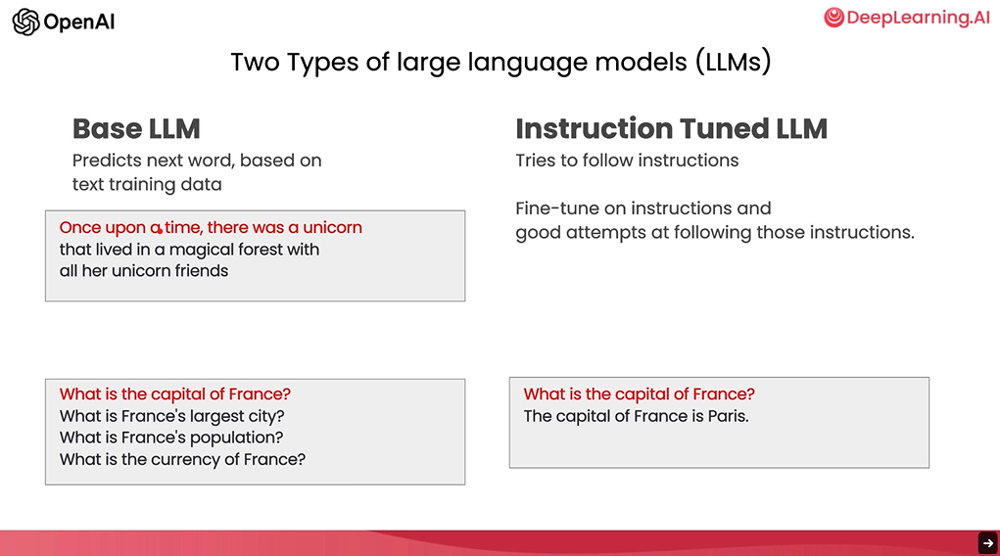

A lot of the "30 prompts everyone should know" focuses on the web user interface of ChatGPT.
But the truly amazing usage lies in how quickly one can build software applications.

In this course we will learn what we can do with ChatGPT, in the realm of software engineering,
and some of the best practices for doing them.

By the end of the course, we will have built a chatbot using an LLM.

There are two types of LLMs - 
1. Base LLM 
2. Instruction Tuned LLM

Instruction tuned LLMs do RLHF - Reinforced Learning with Human Feedback.

Timestamp - 04:13
